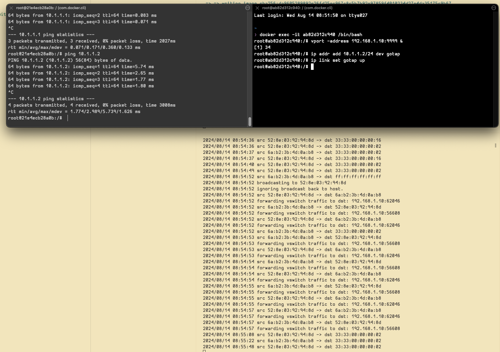

# Go VSwitch 

A virtual switch in GoLang ported from https://github.com/peiyuanix/build-your-own-zerotier.

# Running 

1. Build and run docker compose: `docker compose build && docker compose up`
2. Start the vswitch on host machine: `go run ./cmd/vswitch/vswitch.go`
3. Open a shell in each docker container.
4. In shell one: 
    
    a. `vport -address ${vswitch_host_ip}:${vswitch_host_port} &`

    b. `ip addr add 10.1.1.1/24 dev gotap`

    c. `ip link set gotap up`
5. In shell two:
    
    a. `vport -address ${vswitch_host_ip}:${vswitch_host_port} &`
    
    b. `ip addr add 10.1.1.2/24 dev gotap`
    
    c. `ip link set gotap up`
6. Ping one another:
    
    a. In container 1: `ping 10.1.1.2`
    
    b. In container 2: `ping 10.1.1.1`

 
